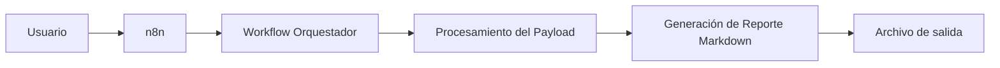

# Orquestador de Procesos con n8n

## Descripción general

Este proyecto implementa un flujo de automatización utilizando **n8n** como motor de orquestación.

La solución permite ejecutar un proceso automatizado mediante un workflow previamente configurado, procesando un archivo de entrada y generando un reporte final en formato Markdown.

El entorno está preparado para ejecutarse localmente mediante contenedores utilizando:

- Docker Compose
- Podman Compose

Esto permite una instalación reproducible y facilita la ejecución del escenario de prueba.

---

# Arquitectura de ejecución



---

# Requisitos previos

Antes de iniciar, se requiere tener instalado uno de los siguientes entornos:

## Opción 1 - Docker

Requerimientos:

- Docker Engine
- Docker Compose

Validar instalación:

```bash
docker --version
docker compose version
```

---

## Opción 2 - Podman

Requerimientos:

- Podman
- Podman Compose

Validar instalación:

```bash
podman --version
podman-compose --version
```

---

# Instalación

## 1. Clonar repositorio

Ejecutar:

```bash
git clone git@github.com:ccrp87/bc-test.git
```

---

## 2. Acceder al directorio del proyecto

```bash
cd bc-test
```

---

# Ejecución del entorno

## Usando Docker Compose

Ejecutar:

```bash
docker compose up -d
```

El comando iniciará los servicios definidos en el archivo:

```
docker-compose.yml
```

---

## Usando Podman Compose

Ejecutar:

```bash
podman-compose up -d
```

---

# Validación del servicio

Verificar que el contenedor se encuentre activo.

## Docker

```bash
docker ps
```

## Podman

```bash
podman ps
```

Debe observarse el servicio correspondiente a n8n ejecutándose.

---

# Acceso a n8n

Abrir el navegador e ingresar:

```
http://localhost:5678
```

---

# Creación del usuario administrador

En el primer ingreso a n8n se debe crear el usuario administrador.

Completar los datos solicitados:

- Nombre
- Correo electrónico
- Contraseña

Este usuario permitirá administrar los workflows, credenciales y configuraciones de la instancia.

---

# Importación del Workflow

El flujo de automatización se encuentra disponible en la raíz del proyecto:

```
flujo_orquestador_json_n8n.json
```

## Pasos para importar

1. Ingresar a n8n.
2. Abrir el menú de workflows.
3. Seleccionar:

```
Import from File
```

4. Seleccionar el archivo:

```
flujo_orquestador_json_n8n.json
```

5. Guardar el workflow importado.

---

# Ejecución del flujo

Una vez importado el workflow:

1. Abrir el flujo:

```
flujo_orquestador_json_n8n
```

2. Ejecutar:

```
Execute Workflow
```

3. Esperar la ejecución completa de los nodos.

---

# Archivo de entrada

Para facilitar la ejecución del escenario de prueba, los pasos iniciales del workflow se encuentran configurados con valores previamente cargados.

Esto evita realizar nuevamente el proceso de carga inicial del archivo.

Sin embargo, es posible realizar pruebas utilizando un nuevo archivo.

El archivo de ejemplo se encuentra en:

```
payload.json
```

Ubicación:

```
/
├── payload.json
```

---

# Uso de un nuevo archivo de entrada

Para procesar un archivo diferente:

1. Reemplazar el archivo:

```
payload.json
```

por el nuevo contenido.

2. Ejecutar nuevamente el workflow.

3. Validar los resultados generados por los nodos posteriores.

---

# Visualización del reporte generado

El workflow genera un reporte final en formato Markdown.

Para visualizarlo:

1. Ejecutar completamente el workflow.
2. Ubicar el nodo:

```
Exporta como archivo
```

3. Seleccionar la opción:

```
Download
```

El archivo descargado corresponde al reporte generado durante la ejecución.

---

# Gestión del entorno

## Ver logs

### Docker

```bash
docker compose logs -f
```

### Podman

```bash
podman-compose logs -f
```

---

## Detener servicios

### Docker

```bash
docker compose down
```

### Podman

```bash
podman-compose down
```

---

## Reiniciar entorno

### Docker

```bash
docker compose down
docker compose up -d
```

### Podman

```bash
podman-compose down
podman-compose up -d
```

---

# Solución de problemas

## No puedo acceder a n8n

Validar que el puerto configurado esté disponible:

```bash
ss -tulpn | grep 5678
```

Si existe otro proceso utilizando el puerto, detenerlo o modificar la configuración del servicio.

---

## El contenedor no inicia

Revisar los logs:

```bash
docker compose logs -f
```

o:

```bash
podman-compose logs -f
```

Validar:

- Variables de entorno.
- Puertos publicados.
- Permisos sobre volúmenes.
- Disponibilidad del motor de contenedores.

---

## El workflow no aparece después de importar

Validar:

- Que el archivo importado sea:

```
flujo_orquestador_json_n8n.json
```

- Que la importación haya finalizado correctamente.
- Que el usuario tenga permisos administrativos.

---

# Consideraciones técnicas

- El workflow está diseñado para ejecución local.
- El archivo JSON permite replicar la automatización en otra instancia n8n.
- Los archivos utilizados en la prueba están incluidos dentro del repositorio.
- El flujo puede ser extendido agregando nuevos nodos de procesamiento, integración o persistencia.

---

# Licencia

Proyecto desarrollado para fines de evaluación técnica y demostración de capacidades de automatización mediante n8n.